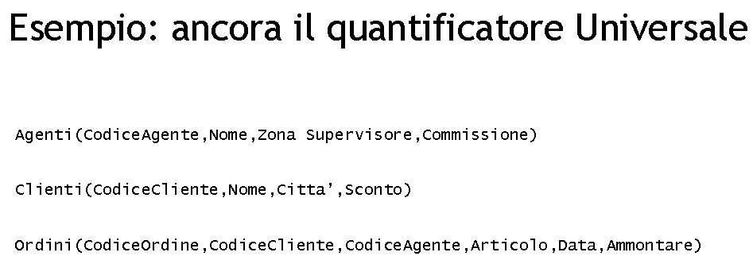
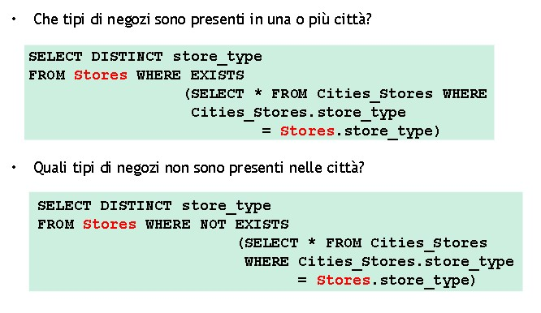
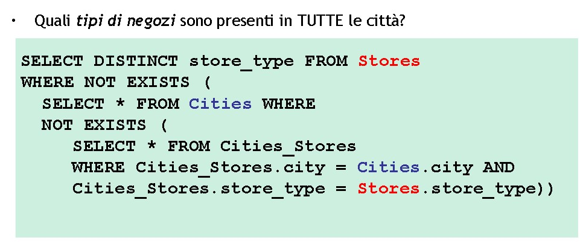
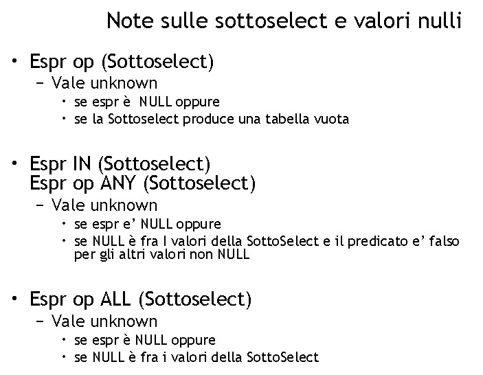

# **DB - 10**

* *Ripasso slides precedenti con operatori*

* EXISTS -> V se la sottoquery restituisce almeno un record, F se restituisce l'insieme vuoto

***

## **QUERY ANNIDATA**

* L'interrogazione interna viene eseguita una volta per ciascun record della query esterna

        Studenti(matricola, nome, ind, tel);  
    <br>

    ***QUERY: trovare tutti gli studenti con lo stesso nome***

    ```SQL
    SELECT DISTINCT name  --  <--stamperà tutte le persone che hanno almeno un omonimo
    FROM Studenti s
    WHERE EXISTS(
        SELECT * 
        FROM studenti s2
        WHERE s2.nome = s.nome 
        AND s2.matricola <> s.matricola
    )
    ```

    ***QUERY: trovare tutti gli studenti CHE NON hanno omonimi***

    ```sql
    SELECT *
    FROM Studenti s
    WHERE NOT EXISTS (
        SELECT *
        FROM Student S2
        WHERE S2.Nome = S.Nome
        AND   S2.Cognome = S.Cognome
        AND   S2.Matricola <> S.Matricola
    )
    ```

    

***




la relazione "ordine" fa da perno consentendo di "connettere" le altre due

c PER OGNI agente a di catania ESISTE ordine o TALECHE o.c = c AND o.A = a 

PER OGNI agente ESISTE un ordine  ---> quindi non esiste un agente di catania per il quale non esista un ordine

*Sarebbe possibile risolvere attraverso una count? Verificando che il numero di agenti e il numero di ordini con agenti diversi che io ho fatto siano uguali?*


```sql
    SELECT * 
    FROM Clienti c -- prendo il cliente
    WHERE NOT EXISTS (
        SELECT *  
        FROM Agenti a -- prendo il primo agente di catania
        WHERE zona = 'Catania'
        AND 
        NOT EXISTS (  -- l'ordine esiste? mi fermo SE ESISTE un agente a cui non ho fatto un ordine. 
            SELECT *
            FROM ordini o   -- cerco gli agenti a cui io NON ho fatto un ordine. se restituisce qualcosa la not exists sarà falsa e passo al record successivo
            WHERE o.codicecliente = c.codicecliente --Restituisce vero se l'insieme è vuoto
            AND   o.codiceagente = a.codiceagente -- se non riesco a trovare agenti per i quali io non abbia fatto ordini, allora è vero: io sarò parte dell'output perché ho fatto ordini a tutti gli agenti di catania
        )
    )

```

**una query che utilizza una doppia not exists può fare ciò che fa il quoziente in algebra relazionale (attenzione all'ordine di nidificazione)**

**NOT EXISTS** <br>
--> vera quando la sottoquery restituisce insieme vuoto  
            --> falsa quando restituisce qualcosa di diverso dall'insieme vuoto


**Equivalente algebra relazionale**

    Cliente NATJOIN (PROIEZ[codice cliente, codice agente](ordini)   /  PROIEZ[codice agente](RESTRINZ[zone = 'catania'](Agenti)))

***

        City(id, city, country, district, population);
        Cities_Stores(city, store_type, address);
        Stores(store_type, description);





Simile alla query analizzata prima

Se volessimo trovvare le città dove sono presenti tutti i tipi di stores dobbiamo INVERTIRE le ultime due sottoqueries:  

        Cities(id, name); 
        storetype(store_type, name); 
        city_stores(city, store_type)

    ```sql
    SELECT * 
    FROM Cities
    WHERE NOT EXISTS (
        SELECT *
        FROM city_stores??? s
        WHERE NOT EXISTS (
            SELECT *
            FROM store_type cs
            WHERE cs.city = c.id
            AND cs.store_type = s.store_type
        )
    )
    ```

Equivalente a 

        (city_stores) / RIDENOM[id->city](PROIEZ[id](Cities))  

        (city_stores) / PROIEZ[storetype](storetype)

***


```sql
    SELECT prodotto *
    FROM prodotto, pc pc1
    WHERE prodotto.modello = pc1.modello 
    AND NOT EXISTS (
        SELECT *
        FROM pc pc2
        WHERE p1.ram > p2.ram -- se non esiste un pc che ha più ram di questa allora lo restituisco! il contrario di quello che chiede perché sto usando una not exists! elenco quello che NON deve esistere
        
    )
    AND NOT EXISTS (
        SELECT *
        FROM pc pc3 -- avremmo potuto chiamarlo pc2 perché lo scope di prima è già andato
        WHERE pc3.velocita > p1.velocita 
        AND pc3.ram = p1.ram
    );
```

***


^-- ultimo punto, il concetto di VISTA poi aiuta

***

        Dipendenti(matricola, nome, stipendio, dip); 

un modo per stampare chi ha lo stipendio più alto possiamo utilizzare la doppia not exists come prima

OPPURE!!!
```SQL
    SELECT nome
    FROM dipendenti, (SELECT max(stipendio) s
                      FROM dipendenti) d1 
    WHERE stipendio = d1.s
```

    * possiamo usare il concetto di sottoquery anche nelle causole from -^^^^^
  

```sql
    SELECT nome
    FROM dipendente 
    WHERE stipendio >= ALL
    (select stipendio FROM dipendenti)
```


```sql
    SELECT nome
    FROM dipendenti
    WHERE stipendio = (SELECT max(stipendio)
                       FROM dipendenti); 
```

***



