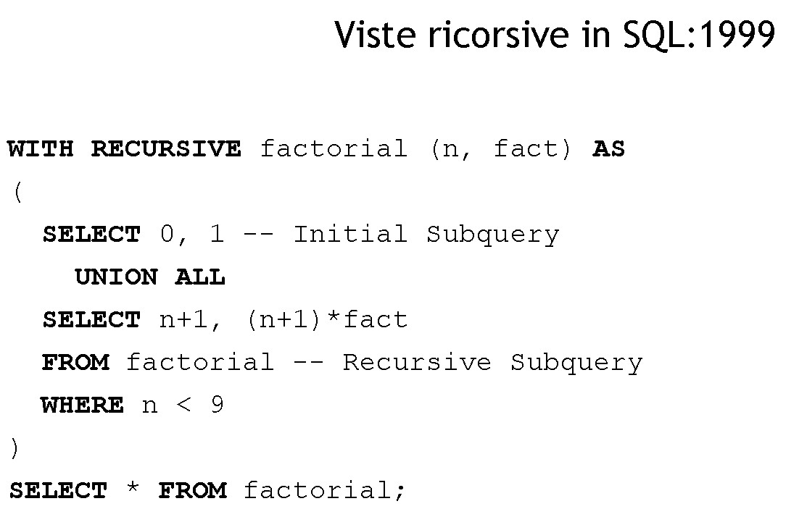
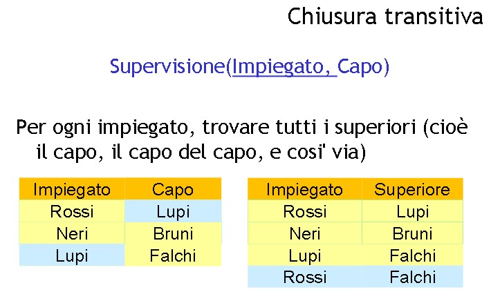
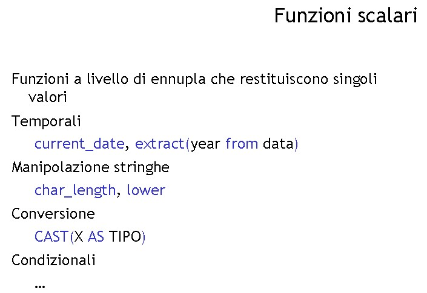
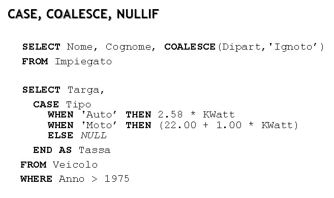
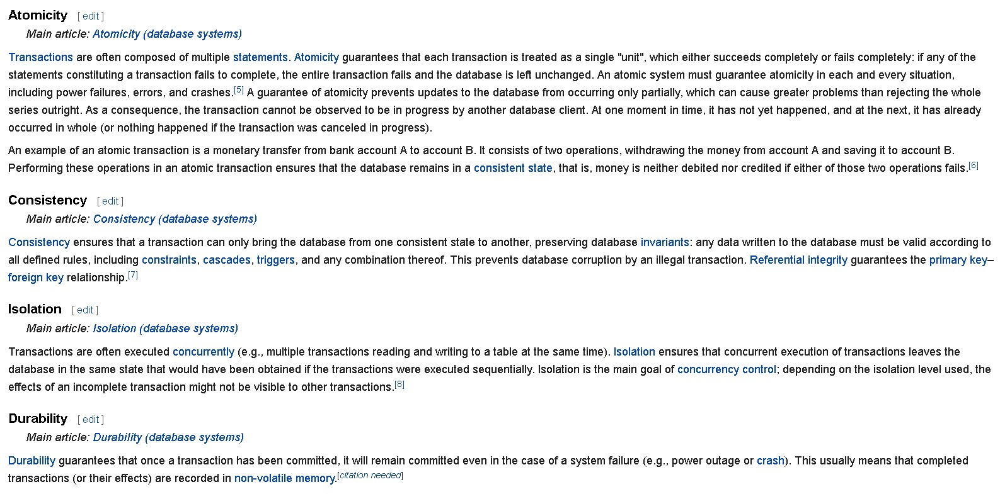
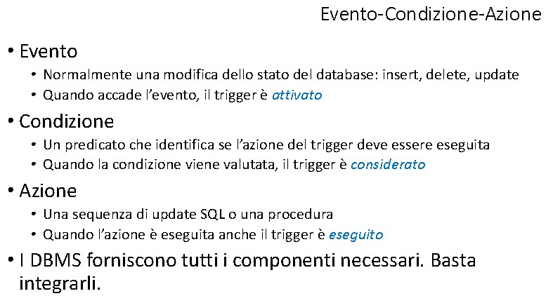
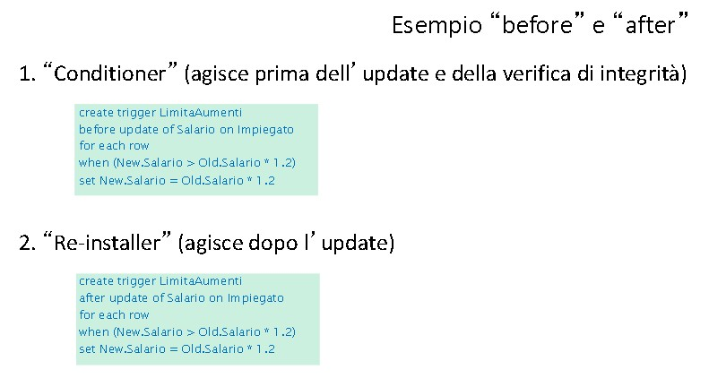

# **DB - 13**

    Rivedere: le viste ricorsive

## **Chiusura transitiva**

        Dato R(x,y)

* le tuple di tipo (x,y) --> appartenenti a R+ se (x,y) **può essere ottenuto da R** con un certo numero di giunzioni/joints



* Caso base delle viste ricorsive: come ciò che abbiamo in input
* Dopo -> Ricorsivo
* Ricorsione in DATALOG --> rivedere operatore With

### **Esempio**

```sql
CREATE VIEW Discendente(Antenato, Discendente) AS 
    SELECT Padre AS Antenato, Figlio AS Discendente -- CASO BASE
    FROM Paternita 
    UNION
    SELECT Padre AS Antenato, Discendente --RICORSIONE LINEARE
    FROM Discendenza, Paternita
    WHERE Figlio = Antenato 
```

* Si chiama ricorsione lineare perché utilizzo solo una copia della tabella in questione
* Sostituendo "CREATE VIEW" con "WITH RECURSIVE" e UNION diventa UNION ALL

```sql
WITH RECURSIVE Discendente(Antenato, Discendente) AS 
    -- CASO BASE
    SELECT Padre AS Antenato, Figlio AS Discendente 
    FROM Paternita 

    UNION ALL

    --RICORSIONE LINEARE
    SELECT Padre AS Antenato, Discendente 
    FROM Discendenza, Paternita
    WHERE Figlio = Antenato 

    SELECT * 
    FROM Discendente
```

* è una vista a tutti gli effetti: con la condizione che dobbiamo mettere la selezione alla fine (obbligatorio: dobbiamo interrogarla subito)
* (E la union all al centro)
* volendo trovare tutti i discendenti di X, la query finale sarà

        SELECT Antenato
        FROM Discendente
        WHERE Discendente = "X"

* DAG = Direct Acyclic Graph

***
## CHIUSURA TRANSITIVA



```sql
WITH RECURSIVE Capi(Impiegato, Capo) AS
    SELECT impiegato, capo
    FROM Supervisione
    UNION ALL
    SELECT c.Impiegato, s.Capo
    FROM Capi c, Supervisione s
    WHERE c.Capo = s.Impiegato

SELECT capo 
FROM capi 
WHERE impiegato = "Rossi"
```

* ALTERNATIVA con Livelli 

```sql
WITH RECURSIVE Capi(Impiegato, Capo, Livello) AS
    -- caso base
    SELECT impiegato, capo, 1
    FROM Supervisione

    UNION ALL
    
    --ricorsione/induttivo
    SELECT c.Impiegato, s.Capo, livello+1
    FROM Capi c, Supervisione s
    WHERE c.Capo = s.Impiegato

SELECT capo, livello 
FROM capi 
WHERE impiegato = "Rossi"
```
            v--             <-- 
        R(key, .., ..., ..., fK)  <-- RELAZIONE RICORSIVA**

***
* FUNZIONI UTILI IN SQL



* Vanno a finire nella target list/select



* operazioni sofisticate sul valore degli attributi

*** 

## **Controllo d'accesso**

* utente _system = DBA = root
* distribuzione dei privilegi (accesso)

* Concessione (grant) e Revoca (revoke) (con restrict o cascade)
* Possibilità di passarli ad altri

* autorizzazioni e commenti (messaggi generali per nascondere informazioni che un utente non dovrebbe avere)
* autorizziamo un utente a vedere solo alcune ennuple/record attraverso una VISTA

* concetto di ruolo (ereditato dai sistemi operativi) a cui si associano i privilegi

## **Transazione** 

* Transazione "acida": Atomicità, Consistenza, Isolamento, Durabilità

* Link to wiki sulle [transizioni acid](https://en.wikipedia.org/wiki/ACID)



* **Atomicità**: cose indivisibili. Un blocco di operazioni, o le eseguo tutte e 4, o se ne eseguo solo una devo essere in grado di tornare indietro

* **Consistenza**: 

* **Isolate**: L'effetto di transazioni concorrenti dev'essere coerente (Database: risorsa condivisa. Delle transazioni concorrenti, ad esempio, devono essere incassate entrambe) Deve avere l'effetto di un accesso sequenziale ai dati (in modo che non ci siano errori)
  * L'accesso sequenziale NON CI PIACE: Lento. Accediamo tutti contemporaneamente ma l'effetto deve essere uguale a un accesso sequenziale. 

* **Durevoli**: committed: rimarrà anche in caso di system failure o crash. Cose che saranno registrate in memoria non volatile

***


* File "bella copia" <----> File log "brutta copia"
* AUTO COMMIT: ogni singola operazione è una transazione
  
```sql
start transaction --(opzionale)
update ContoCorrente
set Saldo = Saldo – 10
where NumeroConto = 12345 ;
--- SE crasha qui so che dovrò annullare
update ContoCorrente
set Saldo = Saldo + 10
where NumeroConto = 55555 ;
-- Se crasha qui dovrò annullare comunque
commit work;
-- Se crasha QUI (dopo il commit) allora devo impegnarmi a levare dal log e trascrivere in bella copia
```

***

## **Basi di dati ATTIVE**

* tramite **"triggers"** 
* Concetto di backups
* BASI DI DATI ATTIVE: legato su degli eventi che si vengono a creare

* **REGOLA ATTIVA --> Triggers** 

* [wiki link](https://en.wikipedia.org/wiki/Database_trigger)

* Paradigma **ECA**
* Evento - Condizione - Azione
  * QUando si verifica un determinato **evento**
  * Valuta una determinata **condizione**
  * Se la condizione è vera, allora guarda il codice, ed esegue l'**azione**

* Ad esempio: se un prodotto ha le scorte sotto un tetto minimo, fai partire l'ordine
* Si può anche usare per i vincoli di integrità
  


* Azione/procedura anche chiamata "Stored Procedure" in questo caso  
* Influenzato da IBM
<br><br>

* **CARATTERISTICHE:**
  * Nome
  * Target (tabella controllata)
  * modalità (before, after)
  * evento (insert, delete, update)
  * granularità(statement level o row-level)
  * alias dei valori o tabelle di transizione
  * azione
  * timestamp di creazione
<br><br>

* Valore prima di insert = Null
* valore prima di update = quello che c'era prima
* come anche nella DELETE
  * (è tutto loggato)
* fsj

***

### Evento **BEFORE** o **AFTER**


* Il trigger può andare a modificare lo stato del database: 
* Es: quando vogliamo verificare una modifica prima che essa avvenga e modificare la modifica



* se metto il controllo nell'after allora il valore errato sarà effettivamente visualizzato per qualche istante nel database
* Nel before --> l'utente non lo vedrà mai
* Se l'attributo che modifico dipende da qualcosa allora si innesca una catena di triggers