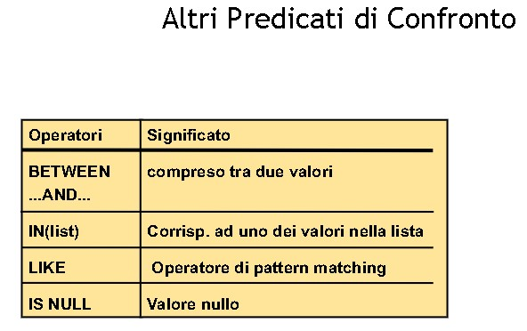
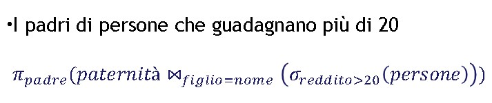
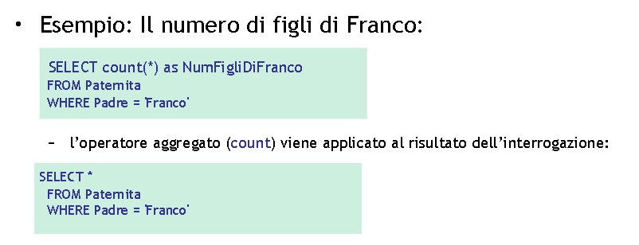
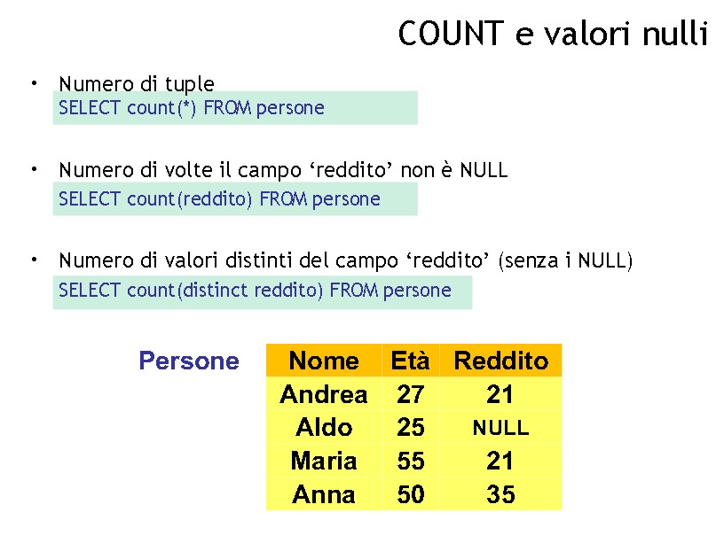
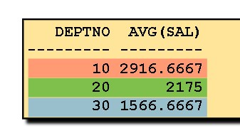
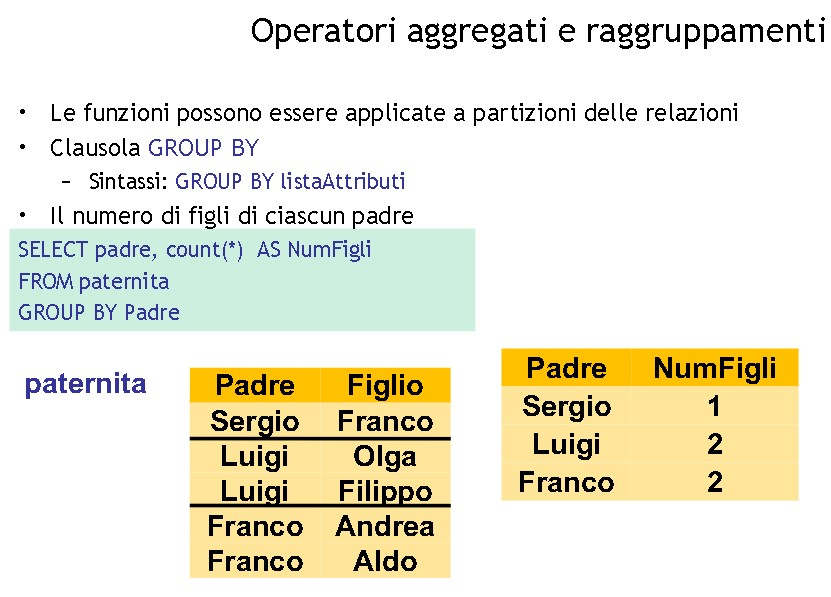
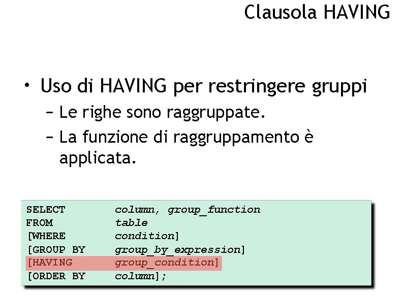
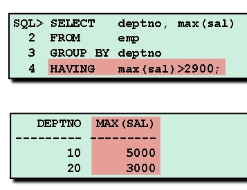
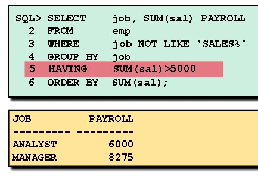

# **DB - 8**

## Ripasso

```sql
    SELECT [DISTINCT] *, ATTR1, ATTR2,  ... ATTRn
    FROM T1, T2, ... Tn
    WHERE condition
```

*** 



***

### **Join Esplicito** 

image.png

```sql
    SELECT ...
    FROM Tabella { ... JOIN Tabella ON Condion_Di_Join},
    [WHERE Altra condizione]
```

```sql
    SELECT paternita.figlio, padre, madre
    FROM maternita JOIN paternita ON paternita.figlio = maternita.figlio
```

### **SELEZIONE, PROIEZIONE, JOIN**

Es: query padri delle persone che guadagnano più di 20

<br><br>

```sql
    SELECT DISTINCT padre --distinct serve così non appaiono records duplicati
    FROM persone, paternita
    WHERE figlio = nome AND reddito > 20
```
<br>= E' EQUIVALENTE A =<br><br>
```sql
    SELECT DISTINCT padre
    FROM persone
    JOIN paternita ON figlio = nome 
    WHERE reddito > 20
```

quest'ultima è più "high level" --> si guadagna in espressività<br><br>

***
<br>
Query dove dobbiamo confrontare padre e figlio: necessità di ridenominare<br><br>


<br><br>

```sql
    SELECT f.nome, f.reddito, p.reddito
    FROM persone p, paternita, persone f
    WHERE p.nome = padre 
    AND figlio = f.nome 
    AND f.reddito > p.reddito
```

<br><br>== OPPURE ==<br>
--> equijoin tra 3 tabelle

```sql
    SELECT 
    FROM persone p JOIN paternita ON p.nome = padre 
    JOIN persone f ON figlio = f.nome -- equijoin 3 tabelle
    WHERE f.reddito > p.reddito; -- thetajoin; tecnicamente posso anticipare questa condizione nella clausola FROM!
```

OPPURE

```sql
    SELECT 
    FROM persone p JOIN paternita ON p.nome = padre 
    JOIN persone f ON figlio = f.nome 
    AND f.reddito > p.reddito; --restrinzione anticipata nel from
```


```sql
    SELECT f.nome, f.reddito, p.reddito
    FROM persone p, paternita, persone f
    WHERE p.nome = padre AND
    figlio = f.nome AND
    f.reddito > p.reddito;
```

***
<br><br>

### **JOIN ESTERNO**
<br><br>
includi padre, e, se nota, madre di ogni persona 

```sql
    SELECT paternita.figlio, padre, madre
    FROM paternita LEFT JOIN maternita 
    ON paternita.figlio = maternita figlio; --se assente il valore maternita allora visualizza NULL
```
<br>

clausola da specificare in alcune versioni di sql = ***OUTER--> "esterno"***


<br><br>
NAT JOIN<br>


***
<br><br>
## **AGGREGAZIONE DI DATI**
<br><br>
* che non potevamo fare in algebra relazionale
* 5 operazioni di aggregamento
* **conteggio, minimo, massimo, media, somma** (min e max si potevano fare con theta join e differenza, qui c'è un operatore)
* costosi computazionalmente
* non sempre il modo per risolvere esercizi
<br><br>
* ***somma è diverso dal conteggio***

* **somma** = somma dei valori
* **conteggio** = conta i records

        AVG -> average = media valori numerici
        COUNT -> conteggio
        MAX 
        MIN
        SUM -> somma valori numerici


        GROUP BY 

***
<br><br>
### **Esempio operatori numerici**
<br><br>

* si possono utilizzare anche con operatori derivati tipo sal+50 etc

```sql
    SELECT  AVG(sal), MAX(sal), MIN(sal), SUM(sal)
    FROM emp
    WHERE job LIKE 'SALES%';
```

esempio di MIN e MAX = utilizzabili anche su altro tipo di tipo

```sql
        SELECT MIN(hiredate), MAX(hiredate)
        FROM emp;
```

* --> SQL esegue la query senza operatori aggregati o funzioni di raggruppamento: RESTRINGE solamente quando arriva alla SELECT, DOPO aver già svolto la query e quando deve dare la visualizzazione all'utente
* ***AVG e SUM ignorano i valori nulli***

***
<br><br>
### **COUNT**
<br><br>
```sql
    SELECT COUNT(*)
    FROM emp
    WHERE deptno = 30; 
```

* COUNT(*) ritorna il numero di righe di una tabella
* COUNT(ATTRIBUTO) il numero di valori di un attributo NON NULL
* In una tabella con tutti valori null, COUNT(*) ritorna **zero**




        --> e se volessimo contare tipo quanti impiegati ha un supervisore, possiamo "collegare" il count ad un'altra tabella?


//ritorna 2 
```sql
    SELECT COUNT(*)
    FROM persone
    WHERE eta <= 30
```

oppure

//ritorna 1 (una delle persone che hanno meno di 30 anni non ha reddito / ha reddito null)
```sql
    SELECT count(redd)
    FROM persone
    WHERE eta <= 30
```



***
<br><br>
### **RAGGRUPPAMENTI DI DATI**
<br><br>
* applicare funzioni di raggruppamento a sottogruppi di una tabella
* es: numero di esami che uno studente ha dato


```sql
    SELECT column, group_function(column)
    FROM table
    [WHERE condition]
    [GROUP BY group_by_expression] -- <--- 
    [ORDER BY columns]; 
```

```sql
    SELECT deptno, AVG(sal) -- <-- 3
    FROM emp         -- <-- 1 
    GROUP BY deptno; -- <-- 2
```



* prima tira fuori tutti i records, li ordina per numero di dipartimento, e calcola la media per ogni gruppo
* il fatto che sia incluso deptno nella targetlist/SELECT è ammessa perché deptno compare nella GROUP BY
* posso anche non inserirlo (visualizzerà solamente gli AVG(sal))
* se scrivessi, invece di deptno, "ename", la QUERY mi da errore: di sintassi e errore pure di semantica
* **se l'attributo non ha contribuito al raggruppamento allora è molto probabilmente sbagliato specificarlo nella targetlist/SELECT**
* 

***
<br><br>




***
<br><br>

**IMPORTANTE!!**

* non posso utilizzare funzioni di raggruppamento nella clausola where!! le funzioni di raggruppamento solo dati elaborati e derivati


***

* posso inserire una nuova clausola "**HAVING**" dopo la clausola GROUP BY --> qui POSSO specificare le funzioni di raggruppamento





* specifico subito dopo group by una condizione sulla quale la group by deve avvenire. perché NON POSSO utilizzare una WHERE con le funzioni (in più, l'ordine è invertito)

***
<br><br>

### **SOMMARIO**
<br><br> 


la ORDER BY è SEMPRE l'ultima in assoluto


