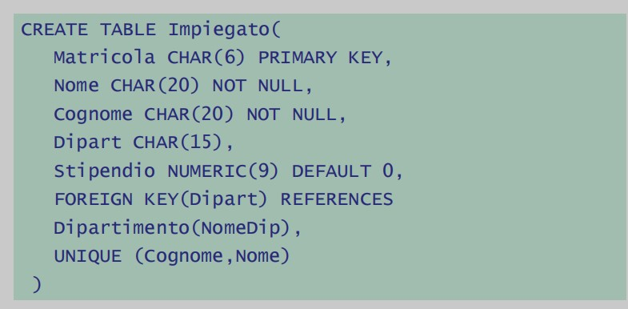
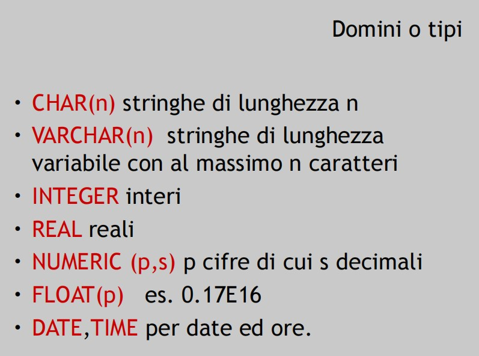
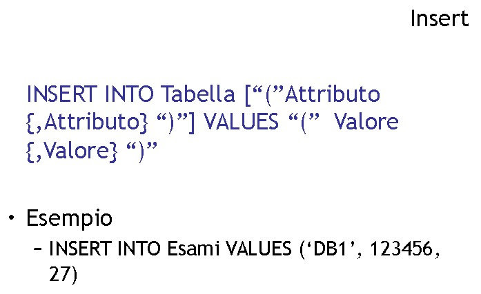
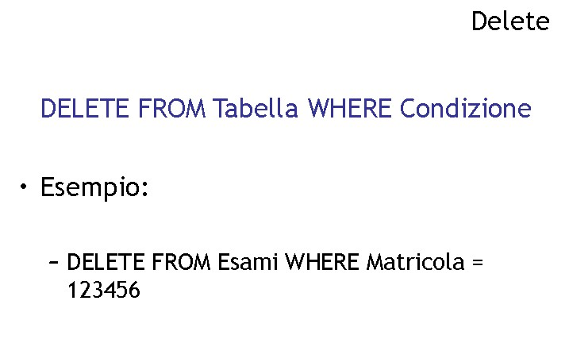
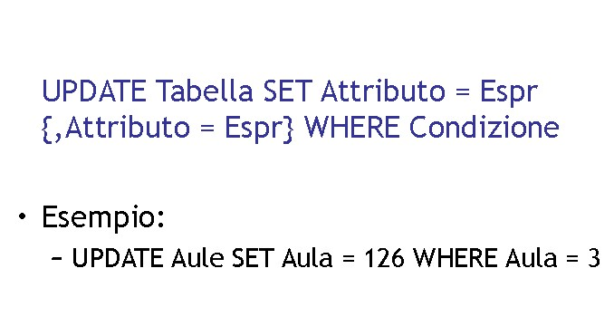
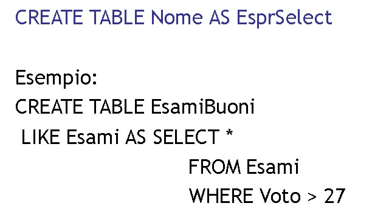

# **DB - 11**

## Ripasso NOT EXISTS

        Stanza(*ID*, numen, piano, letti*); --letti è numerico
        Cliente(*CF*, nome, cognome, data nascita); 
        Prenotazione(Data, --id_stanza--, --CF--, *ID_Pren*); 
        Membri(*--ID_Prenot--, --CF--*);
.
        Query: Trova i clienti che hanno prenotato tutte le stanze matrimonali/con due letti

**Algebra relazionale:**
        CLIENTE ⋈ π[id,cf](Prenotazione)/π[id](Stanza)
        //considera la ridenominazione per gli attributi di nome diverso per fare la join


**SQL:**
```sql

SELECT *
FROM Cliente c
WHERE NOT EXISTS (
    SELECT *
    FROM Stanza s
    WHERE s.letti = 2 --stanze con due letti
    AND NOT EXISTS (
        SELECT *
        FROM Prenotazione p 
        WHERE c.CF = p.CF
        AND s.ID = p.id_stanza --Se questa restituisce un insieme vuoto / falsa allora la NOT EXISTS esterna sarà vera; 
                               --"Non è vero che non ce ne siano" 
    )
)

```

        

        QUERY: Trova tutti i clienti che hanno sempre prenotato con altri due ospiti

***

## **SQL: AMMINISTRAZIONE**

* come creare un database e inserire i dati
* SQL: 
  * Data Manipulation Language
  * Data Definition Language --> quello di oggi
*  Ad ogni utente viene associato un database: 
   *  Database administrator: amministratore del sistema (figura importante con responsabilità) 
   *  Crea il Superuser (amministratore, SUDO etc)
   *  Trasmissione privilegi: l'amministratore può delegare e dare permessi ad altri utenti
*  **Catalogo**: un database/schema che mantiene le informazioni su un altro database/schema (aka information schema) 

        CREATE SCHEMA [nome] AUTHORIZATION [utente]
        [definizioni]
* Viene creato un database come un nome, e un utente viene identificato come amministratore
* Le definizioni creano gli elementi dello schema (Tabelle, viste, indici etc)
        DROP SCHEMA [nome] [RESTRICT/CASCADE]
* Clausole RESTRICT e CASCADE = tutelano da errori: se provo a cancellare databases non vuoti da solo allora viene fermato, se aggiungo CASCADE posso forzarlo ( rm -rf su linux)

        CREATE TABLE
* definisce uno schema di relazione (ne crea una istanza vuota)
* specifica attributi, domini (tipi di dato), vincoli

        CREATE TABLE [nome](
            Attributo Tipo[Vincolo{, vincolo}]
            {, Attributo Tipo [Vincolo{, Vincolo}]}
        ) 


        (riprendere dalle slides)



* Quando definiamo una primary key --> si assegna un indice (struttura dati) ordinato
***
## **Domini elementari**

* Carattere:
* Numerici
* Data, ora (TIMESTAMPS!)

**DOMINI - TIPI**



* VARCHAR usa uno spazio in più che ti da la lunghezza effettiva della stringa
* Quando droppiamo in realtà non cancella: oscura in questo momento
* Spostare dati nella memoria secondaria è LENTO e servono RISORSE, meglio evitare


        CREATE DOMAIN Voto
        AS SMALLINT DEFAULT NULL
        CHECK (value >= 18 AND value <= 30)

* Esempio: Specifico gli intervalli validi
* E' possibile anche alterare i domini e i vincoli 

***
## **VINCOLI**

* Vengono controllati durante le operazioni di modifica
* Riguardano i valori ammissibili
* Però possono avere effetti negativi sulla prestazione
* In certi casi può essere più utile limitare l'input stesso dell'utente tramite l'interfaccia = vincolare l'interfaccia che utilizza l'utente (esempio: dropdown choice invece che un keyboard input)

        NOT NULL
        UNIQUE
        PRIMARY KEY (implica not null)
        CHECK (dopo)

* **Unique <-- CHIAVE**
* **Primary Key <-- CHIAVE PRIMARIA**

        Nome CHAR(20) NOT NULL UNIQUE
        Cognome CHAR(20) NOT NULL UNIQUE

        è diverso da dire

        Nome CHAR(20) NOT NULL 
        Cognome CHAR(20) NOT NULL
        UNIQUE(Nome, Cognome); 

***

## **Vincolo interrelazionale**

* consente di definire le chiavi esterne
* per singoli attributi o su più attributi

***

* Databases sono affidabili e hanno sistemi di backup -> tutto è loggato "a prova di crash"

***
## **vincolo di integrità referenziale**

* ON DELETE 
  * Su default da' "NO ACTION"<-- RIFIUTA l'operazione
  * Si può implementaere una cascade (es: elimino dipartimento e si tira via tutti i dipendenti)
  * oppure set null: setta a null il valore dipartimento per i dipendenti che lavoravano nel dipartimento cancellato

* E' possibile modificare le tabelle con

        ALTER DOMAIN
        ALTER TABLE
        DROP DOMAIN
        DROP TABLE

* utilizzare con parsimonia e non utilizzare mai su chiavi primarie
* per questo la creazione è il momento più importante

***

**INTERROGAZIONE**

* SELECT

**MODIFICA**

* Insert, Delete, Update


<br><br>

<br><br>


* LIKE:

        CREATE TABLE FuoriCorso LIKE Studenti

crea una tabella VUOTA con la stessa struttura di quella LIKE-ata

Con una query la possiamo popolare così

