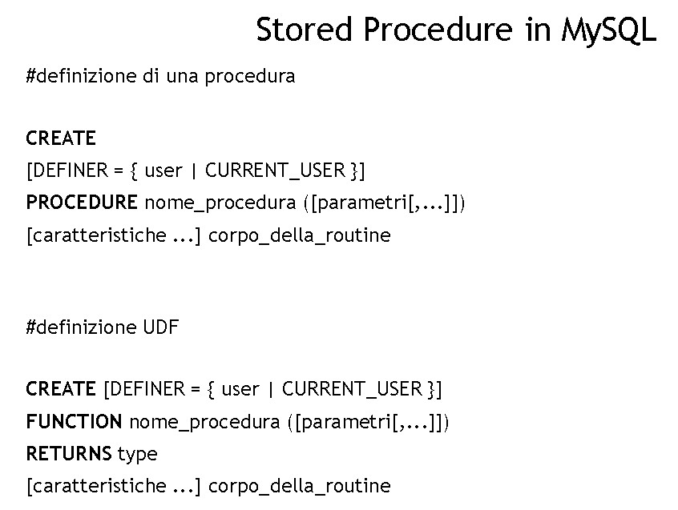
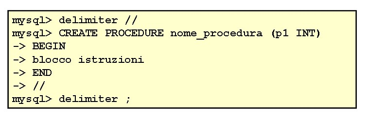
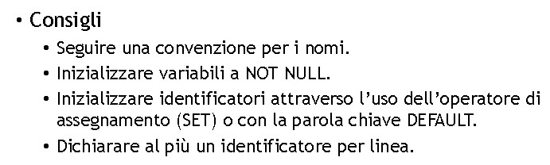

# **DB - 15**

## **Stored Procedure**

* Il più famoso è PL/SQL di Oracle
* Sono estensione dell'SQL
* Possibile scriverle in Java ??

### **PROCEDURA VS FUNZIONE**

* Procedura: non restituisce valori. Le funzioni sì
* Sono riutilizzabili
* Diventa un programma più che una Query, se aggiungiamo altro codice
* Migliorano l'astrazione
* Accesso controllato alle tabelle
* Invocando la SP ottimizziamo: invece di fare 348975394 chiamate con queries, facciamo una unica procedure grande



* I parametri possono essere di INPUT, di OUTPUT, o di INOUT
* Quelli di out possono essere usati DOPO la procedura

* DELIMITER --> bisogna definire un nuovo  delimiter per delimitare il blocco delle istruzioni 



***

## **VARIABILI**

```DECLARE variable_name datatype(size) DEFAULT default_value;```

```sql
DECLARE total_products INT DEFAULT 0 
SELECT COUNT(*) INTO total_products 
FROM products
```



***

## **VARIABILI DI SESSIONE**

--> controlla slides, sono le variabili precedute dal segno @

```sql
DELIMITER $$ 
CREATE PROCEDURE CountOrderByStatus
( IN orderStatus VARCHAR(25), OUT total INT) 
BEGIN 
SELECT count(orderNumber) INTO total 
FROM orders 
WHERE status = orderStatus; 
END$$ 
DELIMITER ;

mysql> CALL CountOrderByStatus('Shipped',@total); 
mysql> SELECT @total AS total_shipped; 

```

***

// ...

***

## **Cursori**

* come un buffer che contiene dati, usati per setacciare (fetch)
* I cursori vengono usati per setacciare un insieme di righe restituite da una query e permette di controllarle
individualmente.
