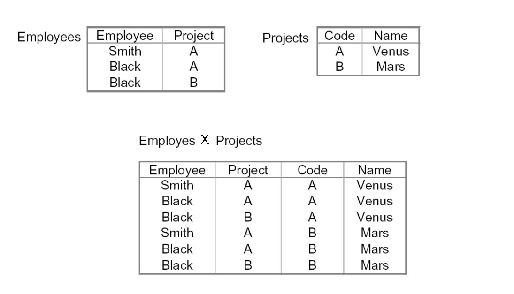

# **ALGEBRA RELAZIONALE** - PT.2

Intersezione = operatore derivato
    R e S due insiemi ----> (R-(R-S)) è l'intersezione tra R e S.

Proiezione: lavora verticalmente sulla relazione.
    (Lavorando con attibuti che presentano duplicati --> dato che un insieme, la cardinalità della proiezione è MINORE o UGUALE alla cardinalità dell'insieme relazione.)

### **Restrinzione/Selezione** *(NON è la SELECT)*

* agisce orizzontalmente sulla relazione. 
* sigma a cui passo un predicato(funzione che restituisce un booleano)
    * Confronto un attributo e una costante oppure due attributi
    * Le parti atomiche (attributo o costante) possono essere concatenati da operazioni insiemistiche AND, OR, NOT, etc etc
  
    ```
    sigma<sub>lambda</sub>() = {}
    ```

### **Prodotto cartesiano**

* Operatore alla base della giunzione (**JOIN**)
* consente di combinare le uple/record da due relazioni con la condizione che ***non abbiano attributi con nome in comune***
* aspetto puramente sintattico
* Si può applicare tra più di 2 relazioni es R x S x T
* 
    ```
        R x S = {tu | t appartenente a R /\ u appartenente a S}
    ```

* A volte si descrive col simbolo della giunzione


***

Con questi operatori è possibile esprimere cose complesse semanticamente. 

***

## **Operatori derivati**

Qualcosa che compatta una espressione (zucchero sintattico???) che normalmente prenderebbe molto sintatticamente ovvero che semplificano

## **JOIN / Giunzione** 

* riconciliano il contenuto di due o più relazioni

### **NATURAL JOIN** 

* considerando due relazioni r1 e r2; e che condividano un attributo.
* Posso applicare la giunzione naturale --> prendo ogni record di r1, lo confronto con ogni record di r2
* Ma restituisco SOLO quelli il cui valore **COINCIDE** ***su tutti gli attributi che hanno in comune*** (e rappresento questo una sola volta)
* Complessità QUADRATICA --> Perché scorre due volte (due cicli for, uno che scandisce la prima rel, uno la seconda)
    * Con un if in più (gli attributi in comune)

<br>

* **Ridenominazione-> Prodotto cartesiano -> Restrizione -> Proiezione**

* R con attributi XY, S con attributi YZ, Y è in comune.
* R nat-join S --> Relazione di attributi XYZ costituita da tutte le n-uple tali che t[XY] appartiene a R, t[YZ] appartiene a S

```
    R NAT-JOIN S = {t | t[XY] appartenente a R, t[YZ] appartenente a S}
```

* t[XY] appartiene alla proiezione su XY di (R NAT-JOIN S)

* *GLI STESSI VALORI NEGLI ATTRIBUTI CON LO STESSO NOME*

* Esempio car nat-join offences vedi slides

```sql
    O.DEPT = C.DEPT AND O.REGISTRATION = C.REGISTRATION
```

* cardinalità: |P nat-join M| <= |P| x |M|

* Alcuni record possono rimanere fuori dalla Join
  * Ad esempio: 
  * Proiezione <sub>su Owner</sub> **MENO** (C)Proiezione <sub>su C.OWNER</sub> di (Offences nat-join Cars)
  * ^-- come ottenere una tabella con le persone che non hanno avuto multe

***

### **THETA-JOIN**

* considerare due relazioni senza attributi in comune

    Proiezione <sub>su employee, head</sub> di (sigma <sub>su Department = D</sub> di (r1 x r2))

* estensione della nat join
* specificato un predicaato per la selezione delle n-uple
* Operatore derivato
* Quando F è una congiunzione di uguaglianze si chiama **equi-JOIN**, altrimenti **Theta-JOIN**

* Rappresentabile ad albero (utile per capire dove ottimizzare)
  * R ed S --> Prodotto cartesiano --> restrinzione

es: qual è il capo dell'impiegato smith?

    restriz su <sub>Employee = Smith</sub> (r1 NAT-JOIN r2)

***complessità: O(n<sup>2</sup>)***<br><br>
oppure

    restriz su <sub>Employee = Smith</sub> di (r1) NAT-JOIN r2

***complessità: O(n)***

* è possibile guadagnare in complessità e costo

### **EQUI-JOIN**

    * Quando F nella formula della Theta Join è una congiunzione di eguaglianze
    * Tra due relazioni a cui posso applicare il prodotto cartesiano (non hanno cose in comune)
    * Giunzione derivata: 


    * Si rinominano gli attributi Y in S come Y', e si ottiene S'. Si opera equijoin Rispetto a Y e Y'. Si proietta rispetto XYZ.
  
    * Giunzione theta: 
    * EQUI-JOIN: 

***

## **QUERY**

L'algebra relazionale è un linguaggio -> significato ben preciso.
Interrogare un DATABASE. Chiedere delle informazioni specifiche.

Nel database di esempio sono assieme chiave primaria ma ognuno da solo CHIAVE ESTERNA

ESERCIZIO 1 e 2

es 2: riconciliare la tabella rinominando gli attributi che diventerebbero anonimi

ESERCIZIO 3 e 4

ESERCIZIO 5 
--> TUTTI è un **quantificatore universale** 

il per-ogni --> lo rappresento attraverso una differenza di una "non-esistenza" (?? rivedere)

esercizio prof:  

    visualizzare nome e cognome dei dipendenti col salario massimo = più in assoluto / o salario minimo
    hint: si deve usare la THETA-JOIN

## NOTAZIONE PUNTATA

    Capi := Imp <-- posso creare risultati intermedi / temporanei (è una VISTA)
        Posso usarlo anche per query che utilizzano sottoquery

è una **nuova** relazione "Capi", che è una copia di impiegati

invece di confrontare gli attributi della relazione; metto come prefisso l'attributo --> notazione puntata per SPECIFICARE
    Imp=Imp.Matr (invece di rinominare, per discriminare tra gli attributi)

consente di semplificare la notazione e bypassare la ridenominazione

***

## Join INCOMPLETI

quando alcune n-uple non partecipano al JOIN (dangling n-uple)/orfane/spaiate
es: le macchine che non hanno commesso infrazioni

Caso estremo: quando una JOIN restituisce un insieme vuoto
caso estremo 2: nat-join coincide col prodotto cartesiano

val min: 0, val max: n^2


