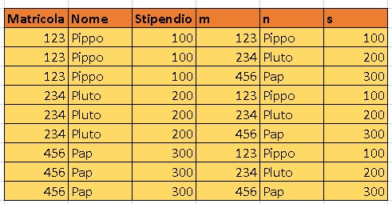
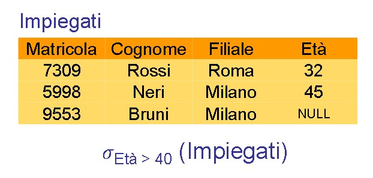
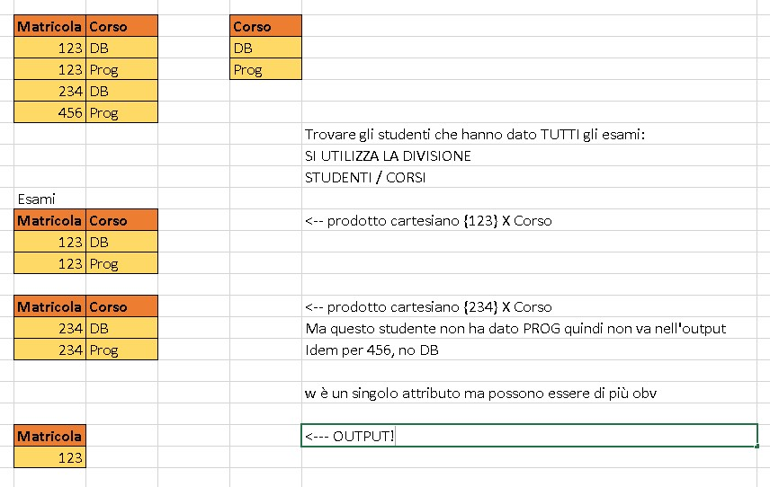

# **DB - 4**

Nat-Join e Equi-join --> simili, ma equijoin è più flessibile: aggira i limiti della n-join

## Nat-Join

-> R e S: R[X,Y], S[Y, Z]
R e S hanno attributi in COMUNE
possono essere chiave primaria in una e chiave esterna nell'altro

R natJoin S --> operatore derivato
{tutte le tuple tali che, prendo la proiezione su t[XY] appartenente a R, AND && t[YZ] appartenente a S.}
Il risultato è una relazione [XYZ]

la proiezione di XY su R natjoin S sarà contenuta in R e anche in S

R(A1, A2, An,....C1, C2, Ck) = (n + k) ATTRIBUTI
S(C1, C2, ...Ck, B1, B2, Bm) = (k + m) ATTRIBUTI

R natjoin S (A1 -- An, C1 -- Ck, B1 -- Bm)

esprimere giunzione naturale attraverso gli operatori primitivi dell'algebra relazionale

    Ridenomino tutti gli attributi in comune (C1 --> C'1, C2 --> C'2, etc) su S

    Adesso posso applicare il prodotto cartesiano tra R e S (non hanno attributi [con nomi] in comune)

    La tabella risultante avrà una grande tabella: 
    
    A1 ... An | C1 ... Ck | C'1 ... C'k | B1 ... Bm

    ---->>>>PASSO IMPORTANTE::: Applico restrinzione: Impongo la condizione che in ogni riga rimarranno quelle in cui C1 combacia con C'1, C2 con C'2, etc.
    tra di loro relazione AND!! 

    Su questo Faccio una proiezione di A1 ... An, C1 ... Ck, B1 ... Bm

Il risultato di tutto questo è R nat-join S

## Equi-Join

Nell'equi-join invece parto con due relazioni, R e S'
**NON HANNO ATTRIBUTI IN COMUNE**

## Theta-Join

Lavora allo stesso modo:
R(X) e S(Y), X /\ Y = insieme vuoto

senza attributi in comune
nella theta join **quando confronto gli attributi NON uso l'uguale**

***

***

## Esercizio

Supponiamo relazione
Dipendente(matricola, nome, stipendio)

________________________________
| Matricola | Nome | Stipendio |
------------|------|------------
123         | Pippo|    200     |
------------|------|------------
234         |Pluto | 200        |
------------|------|------------
456         |paperino|  300     |
------------|------|------------

ridenominaz(Dipendente)
    matricola-> m   
    nome-> n
    stipendio-> s

Faccio il prodotto cartesiano tra la tab dipendenti e quella ottenuta rinominando

AGGIUNGO LA CONDIZIONE :
    restrinzione: Stipendio minore di S
    Lascia solo i record dove la variabile stip assume un valore minore di S

Da qui proietto per Nome, Stipendio, Matricola

---> NOTA: Differenza tra la tabella INIZIALE e la tabella ottenuta con quello che NON voglio per ottenere qualcosa tipo quantificatore universale o "esiste" etc 
Ovvero --> posso costruire le condizioni per arrivare alle n-uple **DANGLING**

### Esercizio

Tabella Dipendenti(matricola, nome, stipendio, reparto);

***Per ogni reparto, trovare lo stipendio più alto***

*** 

***

# **SLIDES 4**

## **GIUNZIONE ESTERNA** 

Giunzioni esterne o OUTER JOIN: posso tirare dentro le tuple che restano fuori dalla join
(Tre varianti: **left**, **right**, **Full**)
Gli attributi DANGLING vengono riempiti con NULL

La proiezione della Natjoin(R, S) è sicuramente contenuta in R
quindi se uno degli attributi non è in comune, la giunzione esterna li proietta comunque, e quell'attributo in comune avrà NULL (in tutti i valori mancanti)

La giunzione esterna destra o sinistra le abbiamo quando proiettiamo in questo modo gli attributi di uno dei due insiemi che l'altro non ha in comune

Guarda slides del NATURAL OUTER JOIN;

considerare tabelle
    Studenti(Matricola, nome)
    Esami(matricola, materia, voto)

    Studenti leftjoin Esami --> MI TIRO DENTRO ANCHE GLI STUDENTI CHE NON HANNO FATTO ESAMI

    equivalente a dire:
    Studenti MENO proiezione di matricola e nome di (Studenti nat-Join Esami) PRODOTTO CARTESIANO {materia = NULL, voto = NULL}

*** 

## **PROPRIETA' DEL JOIN**

Il join è commutativo e associativo
(conviene anticipare (mettere prima) le join che filtrano di più)

E' definito anche se non ci sono attributi in comune (degenera nel prodotto cartesiano)

---> Dati **due** relazioni definite sulla stessa lista di attributi: 
    Allora il NAT-JOIN coincide con l'**intersezione** delle due relazioni! (IMPORTANTE)

### **SEMI GIUNZIONE/Semi Join**
"Tutti gli studenti che hanno fatto ALMENO un esame" 
equivalente a una proiezione di S su una nat-join (Studenti e Esami)

### **Unione esterna** 

date due relazioni R[XY] e S[YZ] allora L'unione esterna sarà:
R X {Z = NULL} Unito a {X = NULL} X S

### **Selezione con valori NULLI**

Di solito si ignora ma abbiamo un operatore per poterli mostrare
 

A causa dei null! i valori null non appaiono né nella prima restrinz né nella seconda (età di Bruni = NULL)

    come includere anche i risultati null: ISNULL (quindi equivale a una unione

***
SONO TIPO DELLE CLASSI (???)
***

## **QUOZIENTE**

* altro operatore dell'algebra relazionale 
* Molto potente 
* Derivato 

Consideriamo R[XY] e S[Y]

R / S = {tutte le tuple w tali che -- }

ESEMPIO 

Considerare tabelle:

    ESAMI(Matricola, Corso)
    CORSI(Corso)

voglio "tutti gli studenti che hanno dato tutti i corsi"

abbiamo 3 studenti: 

* Prendiamo il primo {123} e faccio il prodotto cartesiano con CORSI
  

***

Consideriamo le tabelle

**Prodotto** ( KEY[Codice Prodotto], nome, descrizione, tipologia) 
**Cliente** ( KEY[CF], nome) 
**Acquisto** ( KEY[extrnKEY(CF), extrnKEY(codice prodotto), data]) 

# Secondo esercizio

dimostrare la cosa del quoziente

# Terzo ESERCIZIO

    QUERY: trovare i clienti che hanno acquistato in >TUTTE< le tipologie di prodotti 
    TIPOLOGIA DI QUERY COMPLESSA --> CAPIRE COME FUNZIONA IL QUOZIENTE

* Ho bisogno del quoziente

R := Proiezione del CF e tipologia su (Acquisto NATJOINT prodotto)
S := proiezione del tipo su (PRODOTTO)

R(CF, Tipologia) 
S(tipo)

***R QUOZIENTE S*** = trovo la soluzione della QUERY

**Se contiene** = OK, cliente ha acquistato tutti di quella tipologia

**se non contiene** = NO, esiste almeno una tipologia di cui il cliente non abbia comprato un prodotto

1. Quando divido R e S = R[XY] e S[Y], non può essere al contrario (R[Y] e S[XY])

