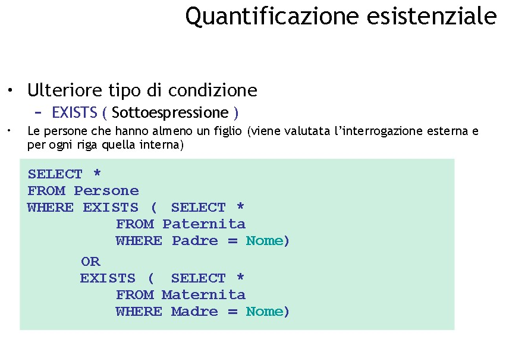

# **DB 9**

```sql
-- RIEPILOGO SINTASSI nella prima slide
```


***


Raggruppando rispetto a una chiave (data alla matricola ho sempre un nome collegato alla matricola) --> posso inserirlo nella target list quando raggruppo

metto in having ciò che non posso specificare da altre parti (tipo in where), per esempio le funzioni di raggruppamento

***


* semanticamente uguali, anche in termini di complessità

* (in questo caso uguale scrivere l'una o l'altra ma il secondo tipo aiuta con queries più complesse)

* Sia quando faccio la join che quando ho una sottoquery è come un for nidificato in un altro for

* Posso utilizzare il parametro della query esterna nella query interna (-->sfrutta i dati delle queries esterne per modificare i dati delle queries interne<--)

*** 

## **Operatori interrogazioni/queries nidificate**

* ANY / ALL 
    
    Any è tipo "qualunque" = "stampa/seleziona" tutti i record che soddisfano una condizione
    -> attenzione a distinguere quale usare quale di queste due

    ```sql
        attributo operatore (ANY / ALL) (Sottoselect/query)
    ```

* EXISTS
    ->Quantificatore esistenziale (?)
    Qualcosa che è vero quando la sottoquery resituisce almeno un record (se restituisce l'insieme vuoto sarà falso)
    ```sql
        [NOT] EXISTS (Sottoselect/query)
    ```
* IN

    Attributo [NOT] IN (Sottoselect)

***

* costo della query proporzionale al numero di record che vado a controllare/costruire(?)

* Le sottointerrogazioni non possono contenere operatori insiemistici (“l’unione si fa solo al 
livello esterno”)

* IN è sinonimo di =(uguale a) ANY
* NOT IN è sinonimo di <>(diverso da) ALL

* Non è possibile usare le funzioni di raggruppamento con una query annidata ----> max(avg(voto)) E' ERRATO!

***



* non ci interessa COSA restituisca ma SE restituisca QUALCOSA

***

### **Negazione con le queries nidificate**

```sql
    SELECT  *
    FROM department d
    WHERE NOT EXISTS (
        SELECT * --metto star perché non mi interessa il contenuto ma se sia l'insieme vuoto o no
        FROM employee
        WHERE Surname = 'Brown' AND dep = d.deptno
    )
```

* In algebra relazionale lo scriviamo invece

        proiez[deptno](Employee) - (Ridenom[dept->department](proiez[DEPT](restrinz[Surname='Brown'](Employee))))

* quindi NOT EXIST (sql) == differenza di ESISTE (alg rel)

* come anche --> dipendente con reddito più alto == non esiste nessuno col reddito maggiore del suo

```sql
    SELECT deptno
    FROM employee e
    WHERE NOT EXISTS (
        SELECT * 
        FROM employee
        WHERE sal > e.sal
    )
```

***

* complessità EXCEPT vs complessità EXISTS
  * In realtà concettualmente sono gli stessi (la prima notazione forse è più intuitivo)

* Con la NOT EXISTS ci vuole sempre SELECT * <--

***

### **Esercizio quantificazione esistenziale** 

**QUERY:** i padri i cui figli guadagnano tutti più di 20

    RELAZIONI: 
        persone(nome, redd);  
        paternita(padre, figlio);  

```sql

---NON VA BENE
    SELECT DISTINCT padre
    FROM paternità p
    WHERE NOT EXISTS (
        SELECT *
        FROM persone 
        WHERE reddito < 20 AND nome = paternita.figlio 
    )
```
^-- non va bene perché devo considerare i figli tutti in una volta

```sql
    SELECT DISTINCT padre
    FROM paternita p
    WHERE NOT EXISTS (
        SELECT *
        
        FROM persone, paternità p1

        WHERE p1.padre = p.padre 
        AND nome = p1.figlio
        AND reddito < 20
    )
```

^-- risolvo con una equijoin  
Se trovo il risultato della sottoquery allora con il WHERE NOT EXISTS quel risultato NON viene inserito nella query effettiva che stiamo cercando 

Gli insiemi vuoi in questo caso faranno parte dell'output: stiamo cercando le cose che ritornano insiemi vuoti nella sottoquery

