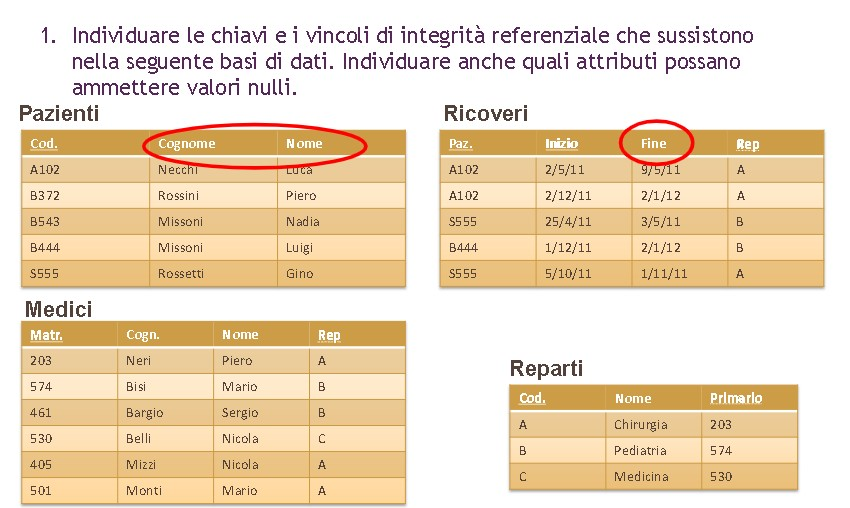
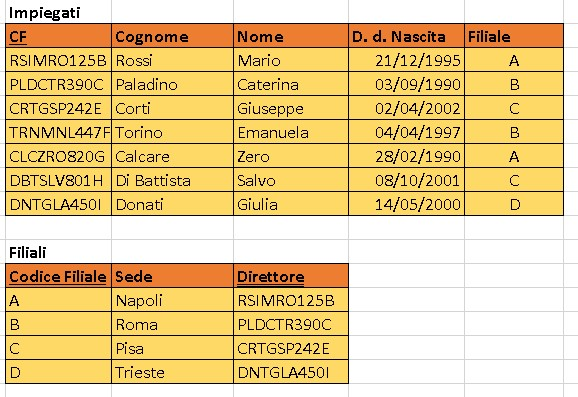

# Esercizi 2 - Modello relazionale

## 1

***Chiavi***: 
    **Cod.** --> Chiave primaria nella relazione Pazienti  
    **(Paz. , Inizio)** --> Chiave nella relazione Ricoveri  
    **Matr.** --> Chiave primaria nella relazione Medici  
    **Cod.** --> Chiave primaria nella relazione Reparti  

Reparto è una chiave esterna di Ricoveri e di Medici. Riferisce la chiave primaria dello schema Reparti.
"Primario" è chiave esterna in Reparti, riferita alla chiave primaria di "Medici".   

***Vincoli di integrità***: 
    ->***Pazienti***:  
        * Il **codice** deve essere una stringa formata da una lettera seguita da tre cifre. 
        * Il **nome** dev'essere una stringa, anche il **cognome**. 
        * Ogni paziente deve avere un Codice 
        * Un codice è univoco per ogni paziente (Ognuno ne ha uno diverso) 
        * (Possono sussistere casi di omonimia.)   
    ->***Ricoveri***: 
        * **Paz.** --> Vedi **Codice** nello schema *Pazienti* 
        * sia **Inizio** che **Fine** vengono inseriti secondo la sintassi gg/mm/aa 
        * Uno stesso paziente non può avere ricoveri nello stesso lasso di tempo 
        * Idem sopra + non possono essere nello stesso lasso di tempo in due reparti diversi 
        * Lo stesso paziente può avere più ricoveri, e in reparti diversi, a patto che la fine del primo sia una data cronologicamente precedente all'inizio del secondo.  
        * **Reparto** deve essere un singolo carattere (maiuscolo) 
        * Ad ogni paziente deve essere associato almeno ad un inizio e ad un reparto.  
    ->***Medici***: 
        * **Matr**. è un intero a tre cifre 
        * **Cognome** e **Nome** --> Vedi cognome e nome in Pazienti 
        *  **Reparto** vedi **Reparto** in Ricoveri 
        *  Ad ogni matricola deve essere assegnato un nome ed un cognome (ammessi casi di omonimia) ed un reparto.  
        *  (Possono ovviamente esistere più medici in uno stesso reparto.)  
    -> ***Reparti*** 
        * Ad ogni Codice deve essere assegnato un Nome e un Codice-Primario 
        * Il Codice Primario deve essere presente nella relazione Medici, e la matricola in Medici deve essere assegnata al reparto corrispondente. (Un medico deve essere primario del Reparto a cui è assegnato) 
        * Non può esistere più di un Primario per codice di Reparto. 
        * Ogni reparto ha un nome diverso. (Non sono ammessi casi di omonimia, altrimenti si tratterebbe dello stesso reparto.) OPPURE Sono ammessi casi di omonimia nel caso in cui esistano più reparti della stessa disciplina.   

Valori che possono assumere il valore NULL: 
    -> **FINE** nella relazione Ricoveri (Il paziente può non aver ancora finito il ricovero) 
    -> **PRIMARIO**, tecnicamente, se deve ancora essere assegnato 

***

## 2 - Esercizio

***Chiavi***:   
**CF** è chiave primaria della relazione **Impiegati**. 
**Codice Filiale** è chiave primaria della relazione **Filiali**.   

***Vincoli d'integrità*** 
    * Ogni impiegato deve avere un nome e cognome e un CF, e una data di nascita 
    * Il CF è univoco per ogni impiegato. (D'altro canto, è possibile che due impiegati siano omonimi o che siano nati lo stesso giorno) 
    * Il CF è formato (in questo caso) da una stringa composta da 6 caratteri (3 presi dal cognome e 3 presi dal nome) seguiti da 3 cifre prese dalle unità di giorno mese e anno di nascita, seguiti da un altro carattere.  
    * Il Cognome e il Nome sono stringhe. 
    * la Data di Nascita dev'essere inserita in forma gg/mm/aa, e l'anno non può essere precedente al 1900, né superiore a (Anno_corrente - età_lavorativa_minima). Mese non può essere superiore a 12 e giorno superiore al giorno massimo del mese. Controllare i bisestili validi.  
    * Ogni impiegato deve lavorare in una filiale.  
    * FILIALE nella relazione Impiegati è una chiave esterna, e si riferisce al CODICE FILIALE della relazione FILIALI  
    * Il codice della filiale dev'essere univoco per ogni diversa filiale.  
    * Possono / Non possono esserci più filiali nella stessa città? Incerto 
    * Ogni Filiale deve avere una SEDE e un DIRETTORE
    * Direttore è una chiave esterna di Filiale, e riferisce il CodiceFiscale della tabella impiegati (per riferirsi univocamente a uno ) E il DIRETTORE dev'essere un IMPIEGATO che lavora nella filiale DI CUI E' DIRETTORE 